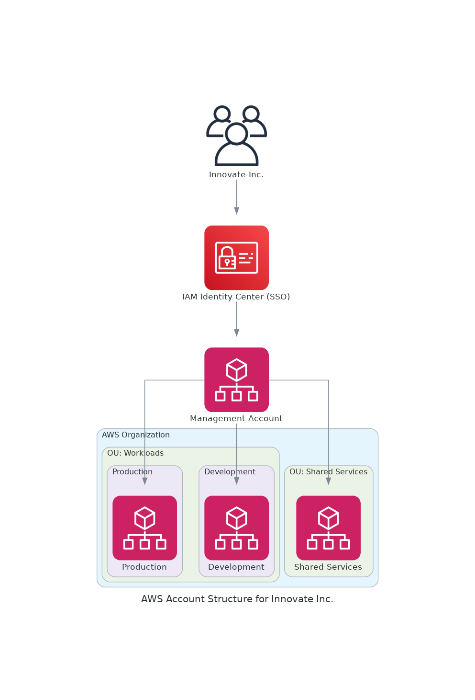
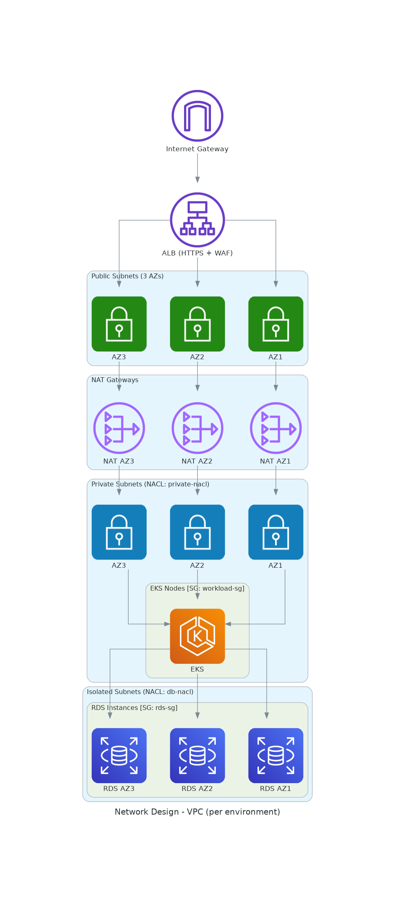
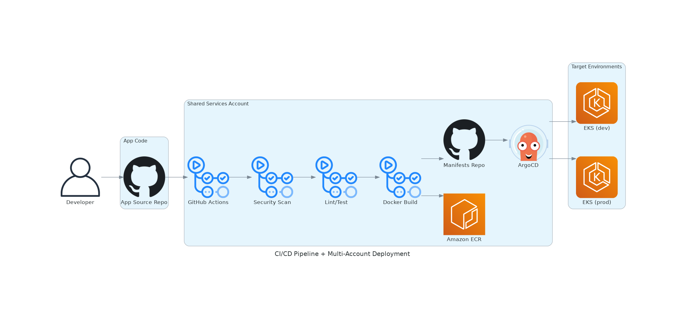
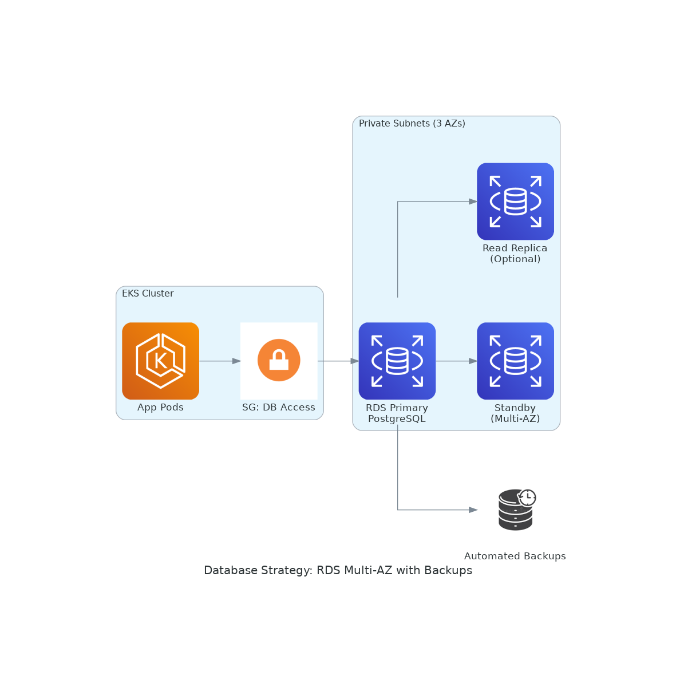
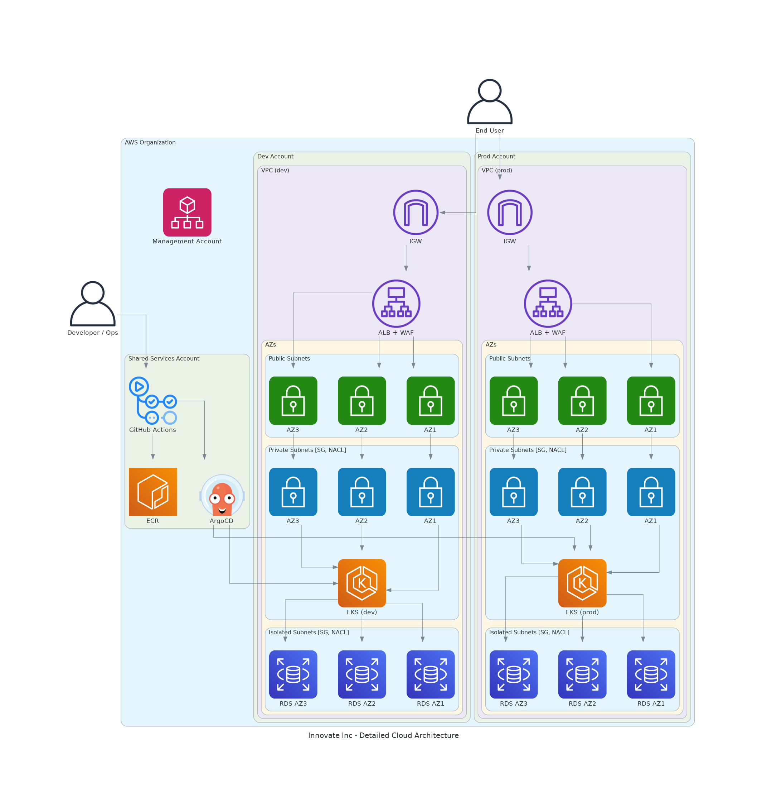

# Innovate Inc. Cloud Infrastructure Architecture

## 1. Cloud Environment Structure

**Chosen Cloud Provider:** Amazon Web Services (AWS)

AWS offers a mature and comprehensive ecosystem of managed services that align with the needs of a rapidly growing startup like Innovate Inc. It provides a global infrastructure with high availability and scalability, robust security capabilities (including IAM, SCPs, and VPC controls), and a wide range of developer and DevOps tools.

AWS also enables strong governance through AWS Organizations and IAM Identity Center with no additional cost, allowing centralized governance and consolidated billing at scale without impacting the startup's budget, making it ideal for implementing a secure and scalable multi-account strategy.

**Recommended Account Strategy:**
Innovate Inc. should adopt a **four-account structure** as part of a multi-account AWS Organization. This includes one `management` account for governance and billing, one `shared-services` account for centralized operational tooling, and distinct accounts for `dev` and `prod` workloads. This model promotes separation of concerns, operational clarity, and long-term scalability.

| Account Name | Purpose |
|--------------|---------|
| `management` | Root account of the AWS Organization. Controls billing, policies (SCPs), IAM Identity Center (SSO), and centralized auditing. Should not host workloads. |
| `shared-services` | Hosts operational services shared across environments: CI/CD (e.g., ArgoCD, GitHub OIDC), container registry (ECR), logging, monitoring, and observability tools. |
| `dev` | Development environment for non-critical workloads. Enables experimentation, fast iteration, and internal testing. |
| `prod` | Production environment. Runs critical Kubernetes workloads and PostgreSQL databases with high availability, performance, and security. |

### Proposed Account Structure

This four-account strategy is aligned with AWS best practices in cloud governance, offering clear advantages in terms of isolation, billing, and management:

**Isolation** is achieved by distributing workloads across separate accounts (`dev`, `prod`) and isolating shared infrastructure in a dedicated account. This prevents cross-environment interference, limits the impact of security incidents, and facilitates granular IAM policy enforcement.

**Billing** is centralized through AWS Organizations, enabling Innovate Inc. to maintain a consolidated view of all account expenditures. This approach simplifies cost allocation and forecasting, while also unlocking volume-based discounts for services like EC2 and S3 across all accounts.

**Management** is streamlined through the use of Organizational Units (OUs), centralized policy enforcement via Service Control Policies (SCPs), and identity management through IAM Identity Center (SSO). Operational tools hosted in the `shared-services` account can be reused across environments, reducing duplication and simplifying maintenance.

This structure enhances operational control and security, while laying the groundwork for scalable expansion into additional environments such as `staging`, `ml`, or `analytics` without significant architectural changes.

## 2. Network Design

**VPC Architecture (per environment):**
Each environment (`dev`, `prod`) will have its own Virtual Private Cloud (VPC) structured across **three Availability Zones (AZs)** to maximize fault tolerance and ensure high availability.

Each VPC includes:

- **3 Public Subnets** (one per AZ) for exposing public-facing services such as ALBs and optionally bastion hosts.
- **3 Private Subnets** (one per AZ) for Kubernetes worker nodes and internal microservices.
- **3 Isolated Subnets** (one per AZ) for databases like RDS, fully disconnected from the internet.
- **1 NAT Gateway per AZ** to allow private subnets outbound access to the internet in a fault-tolerant way.

**Network Security:**

- **Security Groups** offer granular, stateful control at the workload or pod level (e.g., EKS pods, RDS instances).
- **Network ACLs (NACLs)** provide stateless filtering for subnet-level protection.
- **VPC Endpoints** (Interface and Gateway) are used for secure, private communication with AWS services like S3, DynamoDB, and ECR—bypassing the public internet entirely.
- **TLS encryption** is enforced for all traffic, including intra-service communication.
- **Ingress protection** is handled through:
  - **Application Load Balancer (ALB)** with HTTPS termination and integration with **AWS WAF** for layer 7 filtering.
  - **AWS Shield Standard**, enabled by default, protects against common DDoS threats.

### Network Design

This network design implements the **layered security model (defense in depth)** while supporting scalability and reliability. Each subnet type is clearly segmented by function and exposure level, enforcing the principle of least privilege:

- **High Availability:** Spreading resources across multiple AZs protects against single-zone failure.
- **Security:** Public resources are isolated from private and database layers. Databases reside in isolated subnets with no route to the internet.
- **Cost Efficiency:** NAT Gateways are deployed per AZ to balance availability and cost. VPC endpoints reduce the need for NAT traffic.
- **Future-Proof:** This design can scale to new environments, regions, or compliance domains with minimal change.

## 3. Compute Platform

Innovate Inc. will leverage **Amazon EKS (Elastic Kubernetes Service)** as the managed Kubernetes platform of choice. EKS abstracts away control plane operations, offers deep AWS integration (IAM, VPC, CloudWatch), and provides built-in security features.

**Cluster Design:**
A dedicated EKS cluster will be deployed per environment (`dev` and `prod`). This avoids configuration drift, separates concerns, and allows custom resource limits or security policies per environment.

**Node Groups:**

- **Managed Node Groups** will be used to simplify lifecycle management.
- Separate node groups for:
  - **On-demand (baseline)**: Critical services.
  - **Spot (cost optimization)**: Non-critical or fault-tolerant workloads in the development environment only. Spot instances will not be used in production to ensure reliability
  - **Graviton-based instances (ARM)**: To reduce cost and improve performance.
- Node auto-scaling is enabled through **Karpenter**, offering real-time provisioning of right-sized nodes based on workload demand.

**Resource Allocation:**

- Namespaces per application and per team.
- LimitRanges and ResourceQuotas enforced.
- Taints and tolerations to separate workloads by node type (e.g., Spot vs On-demand).
- Pod-level security enforced via IAM roles for service accounts (IRSA).

**Containerization Strategy:**

- **Docker images** will be built using multi-stage builds to reduce image size.
- All images are stored in **Amazon Elastic Container Registry (ECR)**.

### 3.1 CI/CD Strategy with GitHub Actions and ArgoCD

To enable continuous integration and deployment, Innovate Inc. will implement a GitOps-driven pipeline using **GitHub Actions** for CI and **ArgoCD** for CD:

**CI with GitHub Actions:**

- On each code commit or pull request:
  - Linting and unit tests.
  - Docker image build.
  - Security scanning (e.g., Trivy or Amazon Inspector).
  - Push to Amazon ECR.
  - Update deployment manifests (if needed).

**CD with ArgoCD:**

- ArgoCD runs inside the `shared-services` account's cluster.
- It continuously watches Git repositories with Kubernetes manifests.
- Automatically synchronizes state to the target cluster based on the desired configuration.
- Supports progressive delivery strategies like blue/green and canary deployments using Argo Rollouts.

**Best Practices:**

- Separate Git repositories for source code and deployment manifests.
- RBAC-enforced access through ArgoCD Projects.
- Use of Git tags or branches for environment promotion.
- No need for CI pipeline to access Kubernetes API, enhancing security.

**Benefits:**

- **Auditable deployments** with full version control.
- **Rollback capabilities** by reverting Git commits.
- **Separation of duties** between developers (CI) and operations (CD).

This approach balances simplicity, performance, and cost-efficiency:

- **EKS** reduces operational overhead and integrates seamlessly with AWS-native services.
- **Karpenter** provides just-in-time provisioning of optimal EC2 capacity.
- **Node separation** via taints and node groups aligns with security and cost practices.
- **CI/CD with ArgoCD and GitHub Actions** enables auditable, repeatable, and automated software delivery.

This Kubernetes-centric compute platform is flexible, scalable, and secure, designed to grow alongside Innovate Inc.'s projected user base and evolving requirements.

## 4. Database Strategy

**Chosen Service:** Amazon RDS for PostgreSQL

Amazon RDS for PostgreSQL provides a fully managed, cost-effective, and highly available relational database solution that is well-suited for startups. It automates key operational tasks such as provisioning, patching, backups, and failover, allowing Innovate Inc. to focus on development and delivery rather than infrastructure management.

### Database Deployment

- **Engine:** PostgreSQL 16 (latest supported minor version).
- **Storage:** GP3 volumes for cost-efficient SSD performance with tunable IOPS.
- **Instance Type:** 
  - **Production:** Graviton-based (e.g., `db.m6g.large`) for balanced performance and cost.
  - **Development:** Burstable Graviton-based (e.g., `db.t4g.medium`) to reduce cost.
- **High Availability:**
  - **Production:** Multi-AZ deployments with synchronous replication and automatic failover.
  - **Development:** Single-AZ instances without standby to reduce cost (HA not required).
- **Security:**
  - Encryption at rest and in transit (TLS).
  - Access limited to isolated subnets.
  - IAM-based authentication (optional).
  - Backups encrypted via AWS Key Management Service (KMS).

### Backup and Recovery

- **Automated Backups:** Enabled with 7-day retention (configurable).
- **Manual Snapshots:** Taken before major changes.
- **Point-in-Time Recovery (PITR):** Supported and validated.
- **Disaster Recovery (Production only):**
  - Snapshot exports to S3 via AWS Backup.
  - Optional cross-region replication for DR scenarios.

### ✅ Database Architecture

This architecture ensures a secure, reliable, and cost-optimized database layer:

- **Security:** Isolated network placement, encrypted storage and traffic, and optional IAM-based access.
- **Availability:** Multi-AZ and PITR enhance fault tolerance for production workloads.
- **Simplicity:** RDS offloads patching, scaling, and failover operations.
- **Scalability:** Supports vertical scaling and automatic storage growth; Aurora can be adopted later if needed.

### 💰 Cost Considerations

Amazon RDS offers a significantly more affordable alternative to self-managed PostgreSQL or Aurora during early-stage growth. Innovate Inc. can use smaller, burstable instances and simplified configurations in the development environment while reserving high-availability features for production workloads. This strikes the right balance between cost-efficiency and operational readiness.

> **Note:** All high availability, backup, and disaster recovery features are provisioned for the **production environment**. In **development**, these features are optional and excluded by default to optimize costs.

## ✅ Conclusion

This architecture provides Innovate Inc. with a secure, scalable, and cost-effective foundation aligned with AWS best practices. By leveraging a multi-account strategy, segmented network design, managed Kubernetes (EKS), and a robust CI/CD pipeline, the platform is designed to support rapid growth, operational efficiency, and long-term maintainability.

From security and isolation to automation and observability, each layer of the infrastructure is built to minimize operational overhead while ensuring compliance and resilience.

As Innovate Inc. evolves, this modular cloud foundation can be easily extended to support additional environments (e.g., staging, analytics, ML), higher traffic loads, and new business requirements.

---

## 📐 High-Level Architecture Diagram

